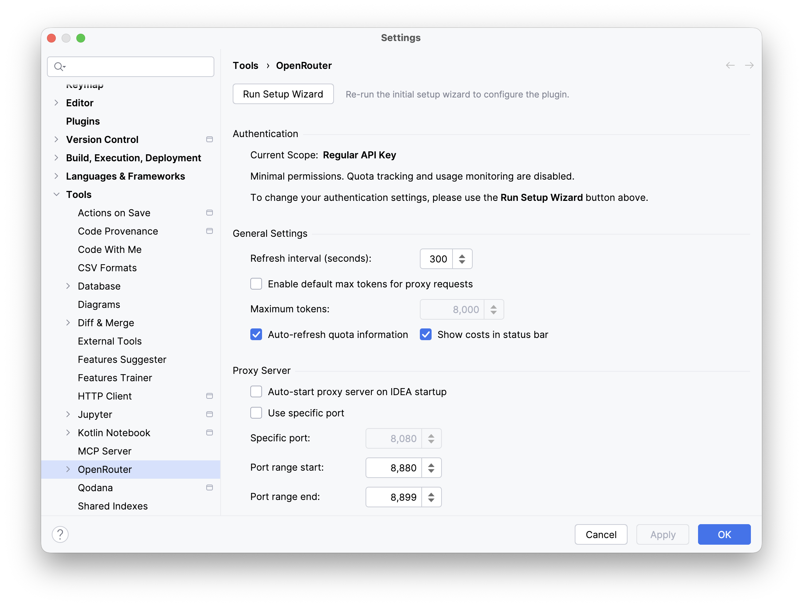

<p align="center">
  
</p>

# OpenRouter IntelliJ Plugin

[](https://plugins.jetbrains.com/plugin/28520)
[](https://github.com/DimazzzZ/openrouter-intellij-plugin/releases)
[](https://github.com/DimazzzZ/openrouter-intellij-plugin/actions/workflows/ci.yml)
[](TESTING.md)
[](https://opensource.org/licenses/Apache-2.0)

An IntelliJ IDEA plugin for integrating with [OpenRouter.ai](https://openrouter.ai), providing access to 400+ AI models with usage monitoring, quota tracking, and seamless JetBrains AI Assistant integration.

## What's New in v0.6.0

- **🎛️ Presets CRUD via OpenRouter API** - Settings → Presets now lists, creates, and updates your OpenRouter presets over the API (no more hand-typed slugs); server-side `tools` config is preserved verbatim
- **⭐ Favorite Models Page Redesign** - One catalog table with a favorite checkbox, favorites-only reorder mode (drag/Alt+↑↓), provider/context/variant/capability filters, and column sorting
- **🏷️ Model Variants** - Model-ID suffixes (`:free`, `:nitro`, `:exacto`, `:floor`, `:batch`) parse into structured values with colored chips and a catalog-driven variant filter
- **🎛️ Provider Routing** - New settings sub-page for global routing defaults, injected into outbound requests without ever overwriting client-supplied `provider`/`models[]`
- **🔧 Streaming Tool-Call Support** - Streaming `delta.tool_calls` are reassembled correctly, unblocking AI Assistant Agent Mode
- **🎨 Brand Refresh** - All plugin icons redrawn to the current OpenRouter brand glyph (theme-aware, HiDPI)

## Key Features

| Feature | Description |
|---------|-------------|
| **💬 Chat Tool Window** | Multi-chat sessions in IDE sidebar with persistent history and token tracking |
| **🤖 AI Assistant Proxy** | Local OpenAI-compatible proxy connecting AI Assistant to 400+ models |
| **🎯 Custom Presets** | Built-in and custom OpenRouter presets for quick model selection |
| **📊 Usage Analytics** | Real-time cost tracking, quota monitoring, and spending estimates |
| **⭐ Favorite Models** | Quick access with filtering by provider, capabilities, and context length |
| **🔐 Secure Storage** | OS-native credential storage (Keychain, Credential Manager, libsecret) |
| **🔌 Plugin API** | Extension point for other plugins to receive balance data |
| **🌍 In-Region Routing** | Pin every request to OpenRouter's EU or US endpoint (Business/Enterprise accounts) |

## Scope

This plugin brings **OpenRouter specifically** into JetBrains IDEs. Everything it offers beyond forwarding a request is built on OpenRouter's own API: the curated model list that becomes your AI Assistant dropdown, variant suffixes such as `:free` and `:nitro`, provider routing defaults, presets, and credit and spend figures read from OpenRouter rather than reconstructed from local logs.

It is deliberately **not** two other things:

- **Not a generic LLM gateway.** The proxy's base URL selects among OpenRouter's own endpoints; it does not point at other providers. If you want one endpoint in front of many providers, with virtual keys, budgets and rate limits, [LiteLLM](https://github.com/BerriAI/litellm) is built for that and does it better than this plugin could.
- **Not a coding agent.** JetBrains ships its own, and several editor agents reach OpenRouter directly. For agentic work the supported combination is this plugin for inference, AI Assistant for the agent loop, and MCP servers for tool execution — see [step 3.1 of the setup guide](docs/AI_ASSISTANT_SETUP.md).

The reasoning, including what this rules out, is recorded in [ADR-0006](docs/adr/0006-openrouter-specific-integration-layer.md).

## Installation

### From Plugin Marketplace
1. Open IntelliJ IDEA → `Settings` → `Plugins`
2. Search for "OpenRouter" in Marketplace
3. Click `Install` (no restart required!)

### Manual Installation
1. Download the latest release from [GitHub Releases](https://github.com/DimazzzZ/openrouter-intellij-plugin/releases)
2. `Settings` → `Plugins` → ⚙️ → `Install Plugin from Disk...`
3. Select the downloaded ZIP file

## Quick Start

### First-Time Setup

When you first install the plugin, a **welcome notification** will appear with a "Quick Setup" button. The wizard guides you through:

1. **Authentication** - Choose OAuth/PKCE (one-click) or Management Key
2. **Favorite Models** - Select your preferred models with search and filtering
3. **Proxy Setup** - Configure AI Assistant integration

### Manual Setup

1. **Open Settings**: `Settings` → `Tools` → `OpenRouter`
2. **Authenticate**: Click "Connect to OpenRouter" for OAuth/PKCE, or paste a [Management Key](https://openrouter.ai/settings/provisioning-keys)
   - A **Management Key** (OpenRouter's own page still titles it "Provisioning Keys") is what lets the plugin read your account: the balance, spend history and per-model breakdown in the Status tab. An ordinary API key can send chat requests but cannot read any of that, so those parts of the tab stay empty and say so.
3. **Select Models**: Go to `Favorite Models` tab and choose your models
4. **Start Using**: Click the status bar widget to access features

### AI Assistant Integration

Connect JetBrains AI Assistant to OpenRouter's 400+ models:

1. Start the proxy server in `Settings` → `Tools` → `OpenRouter`
2. Mark the models you want in `Settings` → `Tools` → `OpenRouter` → `Favorite Models` — **AI Assistant lists your favorites** (with an empty list the proxy falls back to a small default set, but starring what you want is the reliable path)
3. In AI Assistant: `Settings` → `Tools` → `AI Assistant` → `Providers & API keys` → **Third-party AI providers** → **OpenAI-compatible**
   - **Server URL**: Copy from OpenRouter settings (e.g., `http://127.0.0.1:8880`)
   - **API Key**: Leave empty (authentication is handled by the OpenRouter plugin)
   - Menu labels vary slightly across AI Assistant versions — see the [Complete Setup Guide](docs/AI_ASSISTANT_SETUP.md) for version notes

📖 **[Complete Setup Guide](docs/AI_ASSISTANT_SETUP.md)** with screenshots

<p align="center">
  
</p>

## Features

### Chat Tool Window

Access via `View` → `Tool Windows` → `OpenRouter`:

- **Multi-Chat** - Create and manage multiple conversation sessions
- **Model Selection** - Choose from favorites or use presets
- **Persistent History** - Chats saved locally and restored on restart
- **Token Tracking** - Real-time estimation for input and cumulative counts
- **Keyboard Shortcuts** - `Enter` to send, `Cmd/Ctrl+Enter` for newline

### Custom Presets

Manage presets in `Settings` → `Tools` → `OpenRouter` → `Presets`:

- **Built-in Presets** - `openrouter/auto` (best model for task) and `openrouter/free` (free models only)
- **Custom Presets** - Add your own presets created at [OpenRouter Presets](https://openrouter.ai/settings/presets)
- **Chat Integration** - Presets appear at the top of model selector with `@preset/` prefix

### Usage Monitoring

- **Status Bar Widget** - Real-time usage display with color-coded connection status
- **Statistics Popup** - Detailed analytics with days remaining estimate
- **Cost Tracking** - Accurate "Today" statistics with local tracking

### Extension API (for Plugin Developers)

Other plugins can receive balance updates via the `balanceProvider` extension point:

```xml
<extensions defaultExtensionNs="org.zhavoronkov.openrouter">
    <balanceProvider implementation="com.example.MyBalanceProvider"/>
</extensions>
```

See the [CHANGELOG](CHANGELOG.md#051---2026-03-27) for API details and the `BalanceProvider` interface in the source code.

## Compatibility

| | |
|---|---|
| **Supported IDEs** | IntelliJ IDEA, WebStorm, PyCharm, PhpStorm, RubyMine, CLion, Android Studio, GoLand, Rider |
| **IDE Versions** | 2025.3+ and all future versions |
| **Requirements** | Java 21+, [OpenRouter.ai](https://openrouter.ai) account (free or paid) |

## Development

See [DEVELOPMENT.md](DEVELOPMENT.md) for build instructions, testing, and contribution guidelines.

For cutting or re-running a release, see [docs/RELEASING.md](docs/RELEASING.md).

## Legal & Privacy

- **Privacy Policy**: [docs/PRIVACY_POLICY.md](docs/PRIVACY_POLICY.md)
- **End User License Agreement**: [docs/EULA.md](docs/EULA.md)
- **Marketplace Submission Checklist**: [docs/MARKETPLACE_SUBMISSION_CHECKLIST.md](docs/MARKETPLACE_SUBMISSION_CHECKLIST.md)

## Support

- **Issues**: [GitHub Issues](https://github.com/DimazzzZ/openrouter-intellij-plugin/issues)
- **OpenRouter Docs**: [openrouter.ai/docs](https://openrouter.ai/docs)
- **Community**: [OpenRouter Discord](https://discord.gg/openrouter)

## License

Apache License 2.0 - see [LICENSE](LICENSE) for details.

---

*This is an unofficial plugin and is not affiliated with OpenRouter, Inc or JetBrains.*

*The OpenRouter name and logos are trademarks of OpenRouter, Inc. The branded assets bundled with this plugin (the plugin icon and the tool-window, status-bar, badge, and logo SVGs) belong to OpenRouter, Inc and are used here for identification purposes only, per OpenRouter's published [brand assets](https://openrouter.ai/brand). They are not claimed as the plugin author's own work. See [NOTICE](NOTICE) for the full attribution.*
