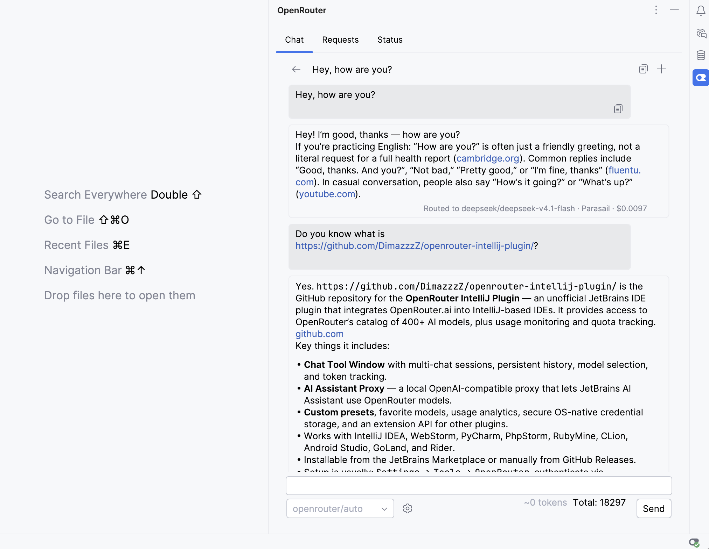
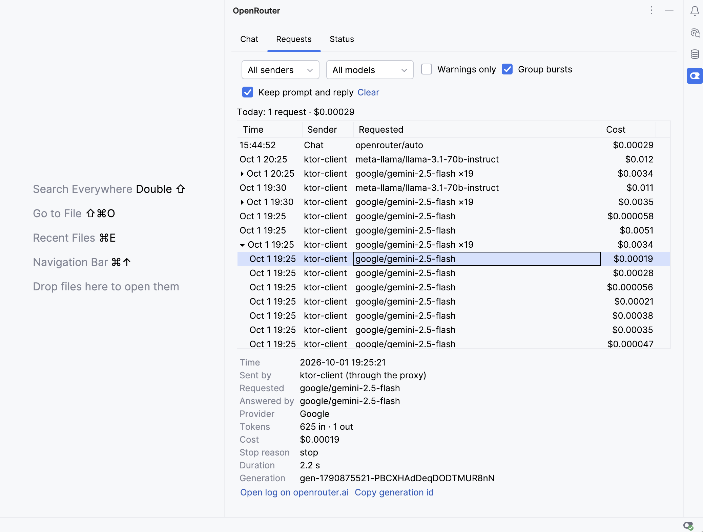
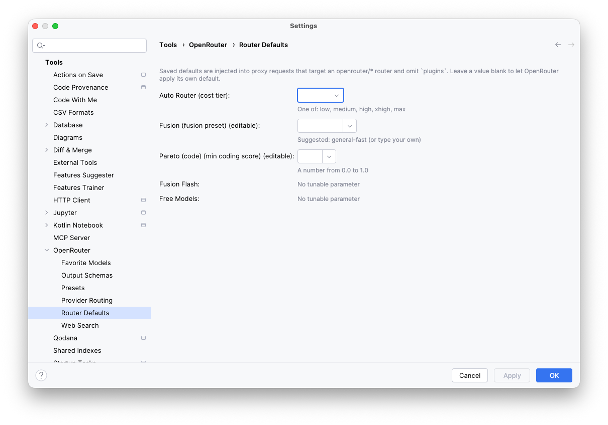
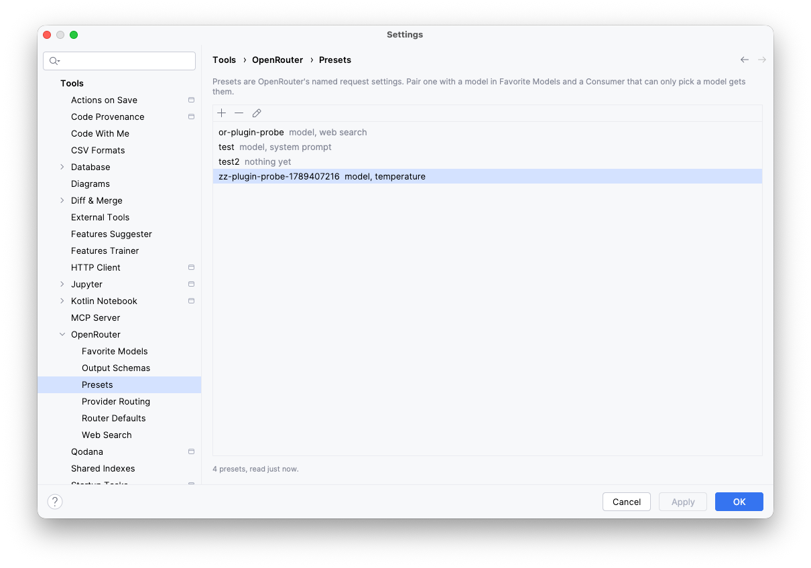
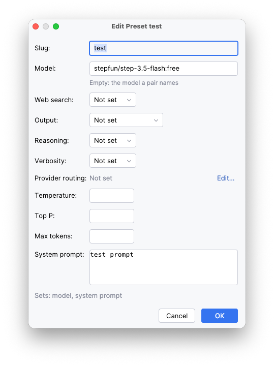
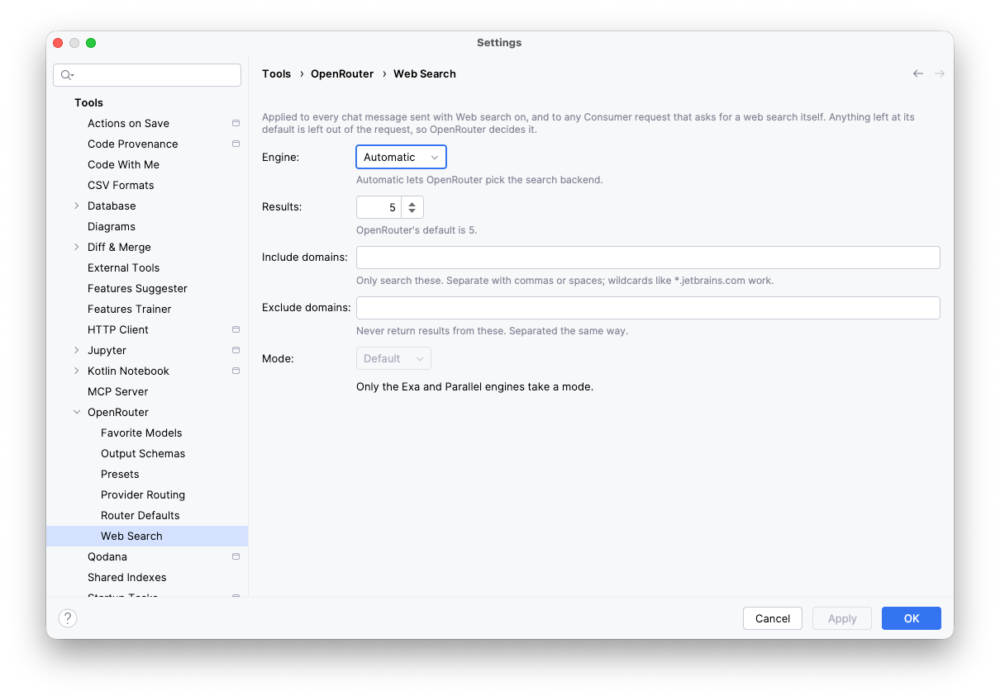
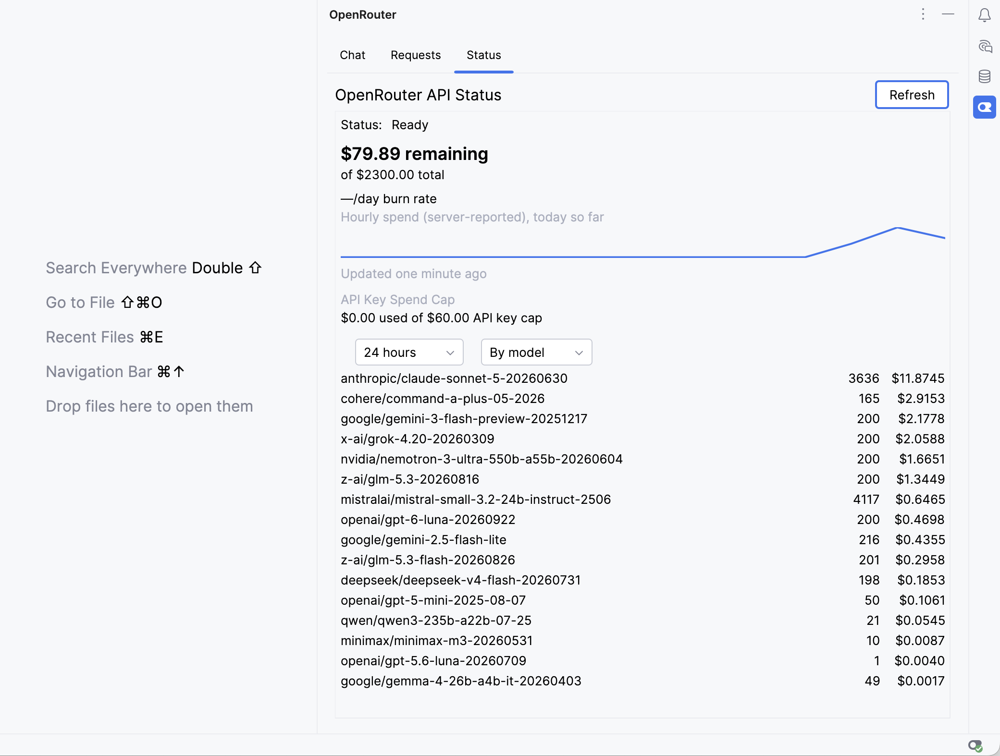
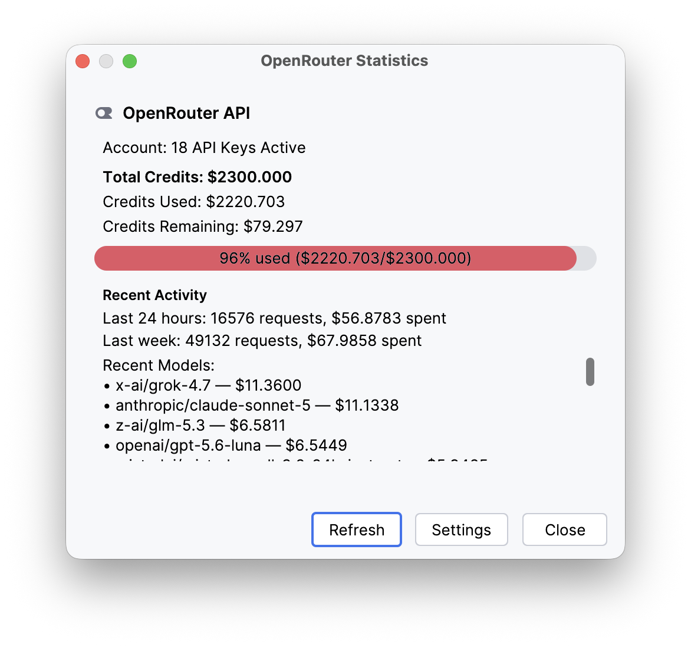

<p align="center">
  <a href="NOTICE"></a>
</p>

# OpenRouter IntelliJ Plugin

[](https://plugins.jetbrains.com/plugin/28520)
[](https://github.com/DimazzzZ/openrouter-intellij-plugin/releases)
[](https://github.com/DimazzzZ/openrouter-intellij-plugin/actions/workflows/ci.yml)
[](TESTING.md)
[](https://opensource.org/licenses/Apache-2.0)

An IntelliJ IDEA plugin for integrating with [OpenRouter.ai](https://openrouter.ai), providing access to 400+ AI models with usage monitoring, quota tracking, and seamless JetBrains AI Assistant integration.

## What's New in v0.7.0

- **📋 Requests Tab** - Every request the plugin sends to OpenRouter, from the chat and from tools using the proxy, in one list: who sent it, the model and provider that answered, tokens, cost and stop reason, with a balloon when one goes wrong. Keeping prompts and replies is opt-in
- **🧭 Routers Hub** - OpenRouter's routers (`openrouter/auto`, `fusion`, `pareto-code`, `fusion-flash` and `free`) are first-class: AI Assistant and every other tool using the proxy see them in their model list, a Router Defaults page sets each router's parameter once, the chat has a router picker, and a routed reply says which model it was routed to
- **🧩 Models Paired With Presets** - "Add with Preset" serves `<model>@preset/<slug>` as its own model, so tools that can only pick a model id (AI Assistant first among them) get a preset's web search, output format and routing
- **📊 Status Tab Redesign** - The real account balance, shared with the status bar, a spend trend with a days-left estimate and spend by model; with an ordinary API key it shows that key's own spend and cap instead of an error
- **🚦 Clear Errors for Tools Using the Proxy** - A request that cannot work is refused up front with an error naming the settings page that fixes it
- **🔎 Web Search and Structured Output in the Chat** - Per-message web search, plain JSON or a saved Output Schema, with new Web Search and Output Schemas settings pages; under every reply, the model, provider, cost and searches that produced it
- **💬 Chat Redesign** - Message bubbles, send parameters in a gear popup, and a composer that survives a narrow tool window without clipping long replies
- **🌍 In-Region Routing** - Pin every request to OpenRouter's EU or US endpoint, offered only where your keys allow it
- **⚖️ Apache-2.0** - The plugin is relicensed from MIT to Apache-2.0

## Key Features

| Feature | Description |
|---------|-------------|
| **💬 Chat Tool Window** | Multi-chat sessions in IDE sidebar with persistent history and token tracking |
| **🤖 AI Assistant Proxy** | Local OpenAI-compatible proxy connecting AI Assistant to 400+ models |
| **📋 Requests Tab** | Every request from the chat and from tools using the proxy, with model, provider, tokens and cost |
| **🧭 Routers** | OpenRouter's routers (`openrouter/auto`, `fusion`, `pareto-code`, …) with per-router defaults |
| **🎯 Presets** | Your OpenRouter presets, edited in the IDE and paired with a model for tools that can only pick a model |
| **📊 Usage Analytics** | Real-time cost tracking, quota monitoring, and spending estimates |
| **⭐ Favorite Models** | Quick access with filtering by provider, capabilities, and context length |
| **🔐 Secure Storage** | OS-native credential storage (Keychain, Credential Manager, libsecret) |
| **🔌 Plugin API** | Extension point for other plugins to receive balance data |
| **🌍 In-Region Routing** | Pin every request to OpenRouter's EU or US endpoint (Business/Enterprise accounts) |

## Scope

This plugin brings **OpenRouter specifically** into JetBrains IDEs. Everything it offers beyond forwarding a request is built on OpenRouter's own API: the curated model list that becomes your AI Assistant dropdown, variant suffixes such as `:free` and `:nitro`, provider routing defaults, presets, and credit and spend figures read from OpenRouter rather than reconstructed from local logs.

It is deliberately **not** two other things:

- **Not a generic LLM gateway.** The proxy's base URL selects among OpenRouter's own endpoints; it does not point at other providers. If you want one endpoint in front of many providers, with virtual keys, budgets and rate limits, [LiteLLM](https://github.com/BerriAI/litellm) is built for that and does it better than this plugin could.
- **Not a coding agent.** JetBrains ships its own, and several editor agents reach OpenRouter directly. For agentic work the supported combination is this plugin for inference, AI Assistant for the agent loop, and MCP servers for tool execution — see [step 3.1 of the setup guide](docs/AI_ASSISTANT_SETUP.md).

The reasoning, including what this rules out, is recorded in [ADR-0006](docs/adr/0006-openrouter-specific-integration-layer.md).

## Installation

### From Plugin Marketplace
1. Open IntelliJ IDEA → `Settings` → `Plugins`
2. Search for "OpenRouter" in Marketplace
3. Click `Install` (no restart required!)

### Manual Installation
1. Download the latest release from [GitHub Releases](https://github.com/DimazzzZ/openrouter-intellij-plugin/releases)
2. `Settings` → `Plugins` → ⚙️ → `Install Plugin from Disk...`
3. Select the downloaded ZIP file

## Quick Start

### First-Time Setup

When you first install the plugin, a **welcome notification** will appear with a "Quick Setup" button. The wizard guides you through:

1. **Authentication** - Choose OAuth/PKCE (one-click) or Management Key
2. **Favorite Models** - Select your preferred models with search and filtering
3. **Proxy Setup** - Configure AI Assistant integration

### Manual Setup

1. **Open Settings**: `Settings` → `Tools` → `OpenRouter`
2. **Authenticate**: Click "Connect to OpenRouter" for OAuth/PKCE, or paste a [Management Key](https://openrouter.ai/settings/provisioning-keys)
   - **A Management Key reads your account; an ordinary API key reads itself.** With a Management Key (OpenRouter's own page still titles it "Provisioning Keys") the Status tab shows your credit balance, spend history and per-model breakdown, and the spend cap across every key on the account. With an ordinary API key it shows that key's own spend and cap, plus the spend this plugin recorded locally — everything account-wide stays empty and says why. Either key sends chat requests.
3. **Select Models**: Go to `Favorite Models` tab and choose your models
4. **Start Using**: Click the status bar widget to access features

### AI Assistant Integration

Connect JetBrains AI Assistant to OpenRouter's 400+ models:

1. Start the proxy server in `Settings` → `Tools` → `OpenRouter`
2. Mark the models you want in `Settings` → `Tools` → `OpenRouter` → `Favorite Models` — **AI Assistant lists your favorites** (with an empty list the proxy falls back to a small default set, but starring what you want is the reliable path)
3. In AI Assistant: `Settings` → `Tools` → `AI Assistant` → `Providers & API keys` → **Third-party AI providers** → **OpenAI-compatible**
   - **Server URL**: Copy from OpenRouter settings (e.g., `http://127.0.0.1:8880`)
   - **API Key**: Leave empty (authentication is handled by the OpenRouter plugin)
   - Menu labels vary slightly across AI Assistant versions — see the [Complete Setup Guide](docs/AI_ASSISTANT_SETUP.md) for version notes

📖 **[Complete Setup Guide](docs/AI_ASSISTANT_SETUP.md)** with screenshots

<p align="center">
  
</p>

## Features

### Chat Tool Window

Access via `View` → `Tool Windows` → `OpenRouter`:

- **Multi-Chat** - Create and manage multiple conversation sessions
- **Model Selection** - Choose from favorites or use presets
- **Persistent History** - Chats saved locally and restored on restart
- **Token Tracking** - Real-time estimation for input and cumulative counts
- **Keyboard Shortcuts** - `Enter` to send, `Cmd/Ctrl+Enter` for newline
- **Reply Summary** - Under every reply: the model that answered (or the one a router chose), the provider and the cost

<p align="center">
  
</p>

### Requests Tab

Every request the plugin sends to OpenRouter, from the chat and from tools using the proxy, newest first: who sent it, the model asked for and the one that answered, the provider, tokens, cost, stop reason and duration. Filter by sender or model, fold bursts from one tool into one row, and open a request's own log on openrouter.ai. Keeping each request's prompt and reply is opt-in.

<p align="center">
  
</p>

### Routers

OpenRouter's routers (`openrouter/auto`, `openrouter/fusion`, `openrouter/pareto-code`, `openrouter/fusion-flash`, `openrouter/free`) appear in every tool's model list and in the chat's model picker. `Settings` → `Tools` → `OpenRouter` → `Router Defaults` sets each router's parameter once; the proxy applies it unless a tool sends its own.

<p align="center">
  
</p>

### Presets

Manage presets in `Settings` → `Tools` → `OpenRouter` → `Presets`:

- **Your OpenRouter Presets** - Read from your [OpenRouter account](https://openrouter.ai/settings/presets), created and edited in a dialog that lists every setting a preset can have
- **Models Paired With Presets** - "Add with Preset" in Favorite Models serves `<model>@preset/<slug>` as its own model, so a tool that can only pick a model gets the preset's settings
- **Chat Integration** - Picking a pair fills the chat's send parameters from its preset, and "Save as Preset…" saves them back

<p align="center">
  
</p>

<p align="center">
  
</p>

### Web Search

`Settings` → `Tools` → `OpenRouter` → `Web Search` sets the engine, the number of results, allowed and excluded domains and the mode once, for every chat message sent with web search on and every tool request that asks for a search.

<p align="center">
  
</p>

### Usage Monitoring

- **Status Bar Widget** - Real-time usage display with color-coded connection status
- **Statistics Popup** - Detailed analytics with days remaining estimate
- **Cost Tracking** - Accurate "Today" statistics with local tracking
- **Status Tab** - Your account balance, a spend trend and spend by model or by API key over 24 hours, 7 or 30 days

<p align="center">
  
</p>

<p align="center">
  
</p>

### Extension API (for Plugin Developers)

Other plugins can receive balance updates via the `balanceProvider` extension point:

```xml
<extensions defaultExtensionNs="org.zhavoronkov.openrouter">
    <balanceProvider implementation="com.example.MyBalanceProvider"/>
</extensions>
```

See the [CHANGELOG](CHANGELOG.md#051---2026-03-27) for API details and the `BalanceProvider` interface in the source code.

## Compatibility

| | |
|---|---|
| **Supported IDEs** | IntelliJ IDEA, WebStorm, PyCharm, PhpStorm, RubyMine, CLion, Android Studio, GoLand, Rider |
| **IDE Versions** | 2025.3+ and all future versions |
| **Requirements** | Java 21+, [OpenRouter.ai](https://openrouter.ai) account (free or paid) |

## Development

See [DEVELOPMENT.md](DEVELOPMENT.md) for build instructions, testing, and contribution guidelines.

For cutting or re-running a release, see [docs/RELEASING.md](docs/RELEASING.md).

## Legal & Privacy

- **Privacy Policy**: [docs/PRIVACY_POLICY.md](docs/PRIVACY_POLICY.md)
- **End User License Agreement**: [docs/EULA.md](docs/EULA.md)
- **Marketplace Submission Checklist**: [docs/MARKETPLACE_SUBMISSION_CHECKLIST.md](docs/MARKETPLACE_SUBMISSION_CHECKLIST.md)

## Support

- **Issues**: [GitHub Issues](https://github.com/DimazzzZ/openrouter-intellij-plugin/issues)
- **OpenRouter Docs**: [openrouter.ai/docs](https://openrouter.ai/docs)
- **Community**: [OpenRouter Discord](https://discord.gg/openrouter)

## License

Apache License 2.0 - see [LICENSE](LICENSE) for details.

---

*This is an unofficial plugin and is not affiliated with OpenRouter, Inc or JetBrains.*

*The OpenRouter name and logos are trademarks of OpenRouter, Inc. The branded assets bundled with this plugin (the plugin icon and the tool-window, status-bar, badge, and logo SVGs) belong to OpenRouter, Inc and are used here for identification purposes only, per OpenRouter's published [brand assets](https://openrouter.ai/brand). They are not claimed as the plugin author's own work. See [NOTICE](NOTICE) for the full attribution.*
