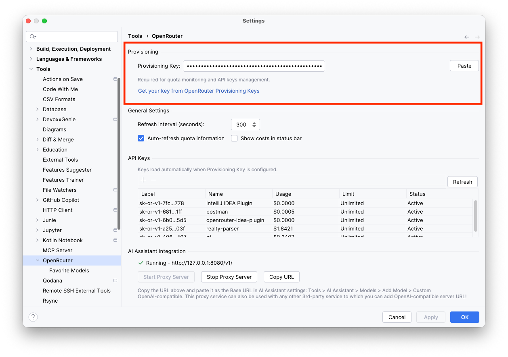
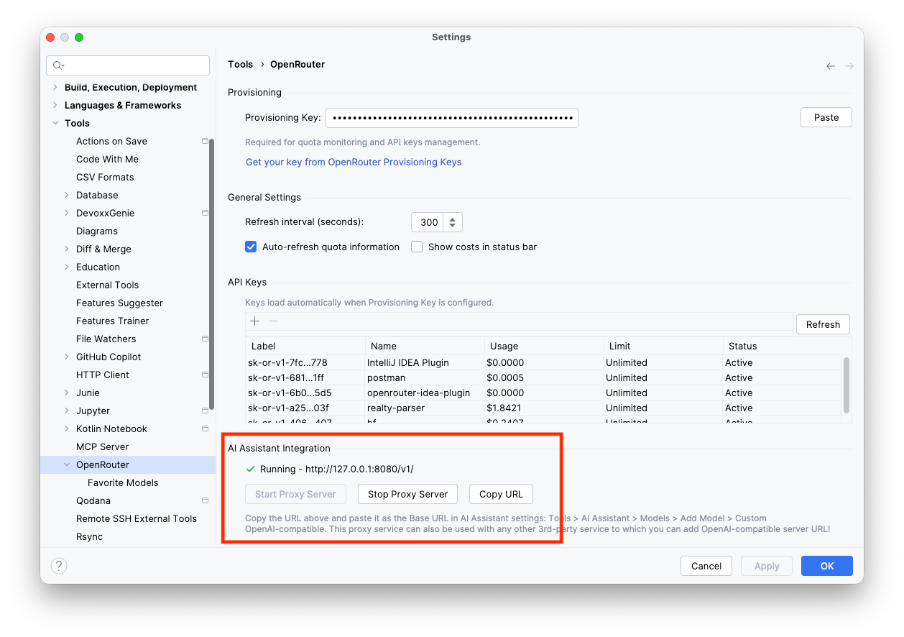
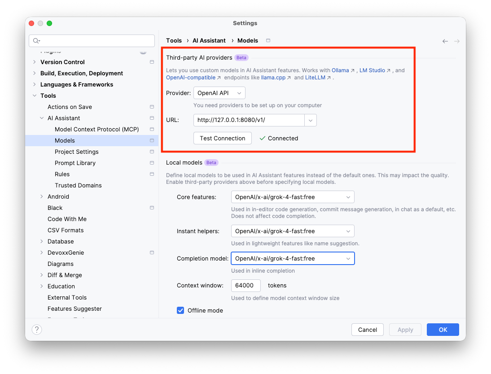
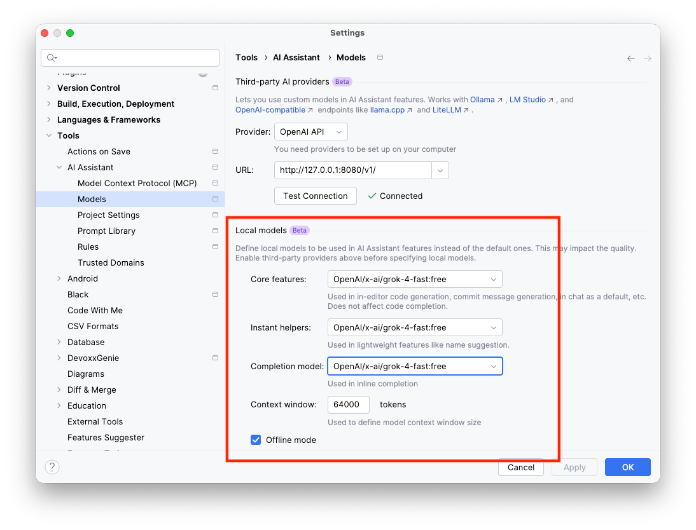
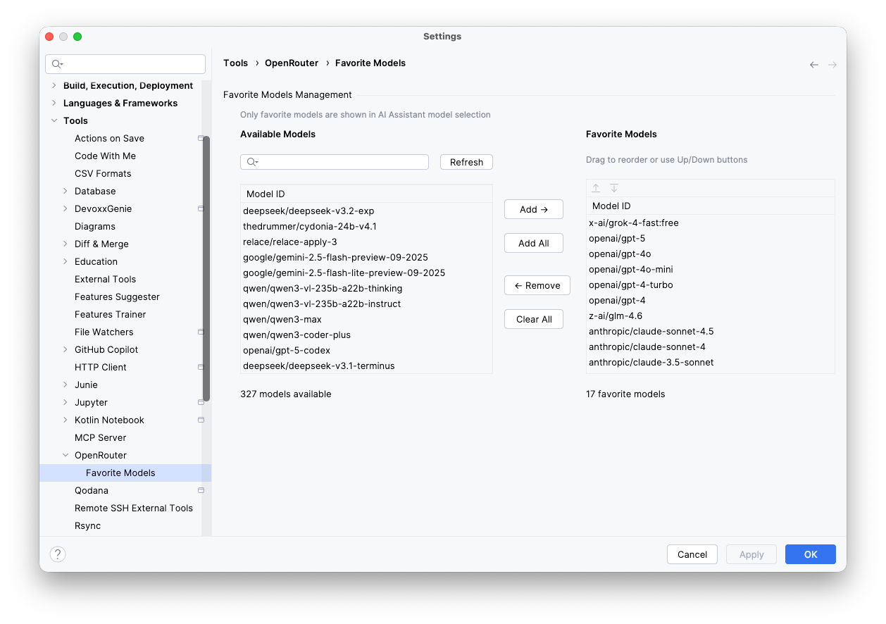

# AI Assistant Setup Guide

This guide explains how to configure JetBrains AI Assistant to use OpenRouter's 400+ AI models through the OpenRouter IntelliJ Plugin's local proxy server.

## 📋 Prerequisites

Before you begin, ensure you have:

1. **IntelliJ IDEA** (or any JetBrains IDE) version 2023.2 or later
2. **OpenRouter Plugin** installed and configured
3. **JetBrains AI Assistant Plugin** installed ([Get it here](https://plugins.jetbrains.com/plugin/22282-jetbrains-ai-assistant))
4. **OpenRouter Account** with a Provisioning Key ([Sign up here](https://openrouter.ai))

## 🚀 Quick Start

### Step 1: Configure OpenRouter Plugin

1. Open **Settings** → **Tools** → **OpenRouter**
2. Enter your **Provisioning Key** from [OpenRouter Provisioning Keys](https://openrouter.ai/settings/provisioning-keys)
3. Click **Test Connection** to verify your key works
4. Click **Apply** and **OK**

OpenRouter settings panel with provisioning key field

### Step 2: Start the Proxy Server

The proxy server should start automatically when you configure your Provisioning Key. You can verify it's running:

1. Open **Settings** → **Tools** → **OpenRouter**
2. Look for the **Proxy Server** section
3. Status should show: **Running on http://127.0.0.1:8080** (or another port 8080-8090)
4. **Copy** the proxy server URL - you'll need it in the next step

Proxy server section showing running status and URL

> **Note**: If the server isn't running, click **Start Server** button.

### Step 3: Configure AI Assistant

Now configure AI Assistant to use the OpenRouter proxy:

1. Open **Settings** → **Tools** → **AI Assistant** → **Models**
2. Configure the custom third-party AI provider:
   - **Provider**: Select **OpenAI API**
   - **Server URL**: Paste the proxy URL from Step 2 (e.g., `http://127.0.0.1:8080`)

AI Assistant custom model configuration dialog

4. Click **Test Connection** to verify the setup
5. Click **OK** to save

### Step 4: Select OpenRouter Model

1. In the AI Assistant chat window, click the **model selector** dropdown
2. Select your OpenRouter custom model
3. Start chatting with any of OpenRouter's 400+ models!

Also, set up default models you want to use in the Local Models section:

AI Assistant model selectors showing OpenRouter models

## 🎯 Available Models

The proxy server provides access to OpenRouter's entire model catalog. Here are some popular models you can use:

### OpenAI Models
- `openai/gpt-4o` - Most advanced GPT-4 model
- `openai/gpt-4o-mini` - Fast and cost-effective
- `openai/gpt-4-turbo` - High performance GPT-4
- `openai/gpt-3.5-turbo` - Fast and affordable

### Anthropic Models
- `anthropic/claude-3.5-sonnet` - Advanced reasoning and analysis
- `anthropic/claude-3-opus` - Most capable Claude model
- `anthropic/claude-3-haiku` - Fast and efficient

### Google Models
- `google/gemini-pro-1.5` - Advanced multimodal AI
- `google/gemini-flash-1.5` - Fast responses

### Meta Models
- `meta-llama/llama-3.1-70b-instruct` - Powerful open-source model
- `meta-llama/llama-3.1-8b-instruct` - Efficient instruction model

### Other Popular Models
- `mistralai/mistral-large` - Mistral's flagship model
- `qwen/qwen-2.5-72b-instruct` - Multilingual coding model
- `microsoft/wizardlm-2-8x22b` - Instruction following

> **Tip**: See the full list of available models at [OpenRouter Models](https://openrouter.ai/models) or in the plugin's Favorite Models panel.

## 🔧 Advanced Configuration

### Using Favorite Models

Favorite models are used to avoid loading all the hundreds of models available in OpenRouter and overloading the 
selectors in the AI Assistant. All models in the Assistant's selectors are shown from the Favorites list.

You can configure your favorite models for quick access:

1. Open **Settings** → **Tools** → **OpenRouter** → **Favorite Models**
2. Select models from the **Available Models** list
3. Click **Add to Favorites** (→ button)
4. Reorder favorites using **↑** and **↓** buttons
5. Click **Apply** and **OK**

Favorite Models settings panel

### Changing Proxy Port

If port 8080 is already in use, the plugin will automatically try ports 8081-8090. You can check which port is being used:

1. Open **Settings** → **Tools** → **OpenRouter**
2. Look at the **Proxy Server** section
3. The current port is shown in the server URL

### Proxy Server Management

You can manually control the proxy server:

- **Start Server**: Click **Start Server** button in settings
- **Stop Server**: Click **Stop Server** button in settings
- **Auto-start**: The server starts automatically when you configure a Provisioning Key
- **Status**: Check the status indicator in the OpenRouter status bar widget

## 🐛 Troubleshooting

### Proxy Server Won't Start

**Problem**: Server status shows "Stopped" or error message

**Solutions**:
1. Verify your Provisioning Key is valid in OpenRouter settings
2. Check if ports 8080-8090 are available (close other applications using these ports)
3. Check IDE logs: **Help** → **Show Log in Finder/Explorer**
4. Look for errors containing "OpenRouter" or "proxy"

### AI Assistant Can't Connect

**Problem**: "Connection failed" error when testing in AI Assistant

**Solutions**:
1. Verify the proxy server is running (check OpenRouter settings)
2. Copy the exact server URL from OpenRouter settings (including `http://` and port)
3. Make sure you're using `http://127.0.0.1:PORT` not `localhost:PORT`
4. Try restarting the proxy server (Stop → Start)

### Model Not Found Error

**Problem**: AI Assistant shows "Model not found" error

**Solutions**:
1. Verify the model ID is correct (check [OpenRouter Models](https://openrouter.ai/models))
2. Use the full model ID including provider prefix (e.g., `openai/gpt-4o` not just `gpt-4o`)
3. Check that your OpenRouter account has access to the model

### Authentication Errors

**Problem**: 401 Unauthorized or authentication errors

**Solutions**:
1. Verify your Provisioning Key is valid at [OpenRouter Settings](https://openrouter.ai/settings/provisioning-keys)
2. Check that the key has sufficient credits
3. Re-enter the Provisioning Key in OpenRouter plugin settings
4. Click **Test Connection** to verify

## 📚 Additional Resources

- **OpenRouter Documentation**: [https://openrouter.ai/docs](https://openrouter.ai/docs)
- **Plugin GitHub**: [https://github.com/DimazzzZ/openrouter-intellij-plugin](https://github.com/DimazzzZ/openrouter-intellij-plugin)
- **Report Issues**: [GitHub Issues](https://github.com/DimazzzZ/openrouter-intellij-plugin/issues)
- **AI Assistant Plugin**: [JetBrains Marketplace](https://plugins.jetbrains.com/plugin/22282-jetbrains-ai-assistant)

## 💡 Tips & Best Practices

1. **Start with GPT-4o Mini**: It's fast, affordable, and works great for most coding tasks
2. **Use Favorite Models**: Configure your most-used models for quick access
3. **Monitor Usage**: Check the OpenRouter status bar widget for real-time usage statistics
4. **Try Different Models**: Different models excel at different tasks - experiment to find what works best
5. **Check Costs**: View detailed cost breakdown in **Tools** → **OpenRouter** → **Show Usage Statistics**

## 🔐 Security & Privacy

- **Local Proxy**: The proxy server runs only on `127.0.0.1` (localhost) - no external access
- **Encrypted Storage**: Your Provisioning Key is encrypted using IntelliJ's secure credential storage
- **No Data Collection**: The plugin doesn't collect or transmit any usage data
- **Direct Connection**: All API calls go directly from your machine to OpenRouter's servers

## ❓ FAQ

**Q: Do I need a paid OpenRouter account?**  
A: No, OpenRouter offers free credits to get started. You can use the plugin with a free account.

**Q: Can I use multiple models simultaneously?**  
A: Yes! You can configure multiple custom models in AI Assistant, each pointing to the same proxy but using different model IDs.

**Q: Does this work with other JetBrains IDEs?**  
A: Yes! The plugin works with all JetBrains IDEs (WebStorm, PyCharm, PhpStorm, etc.) version 2023.2+.

**Q: Will this affect my existing AI Assistant configuration?**  
A: No, this adds a custom model alongside your existing AI Assistant models. You can switch between them freely.

**Q: How do I update the model list?**  
A: The proxy automatically fetches the latest model list from OpenRouter. Just restart the proxy server to refresh.

---

**Need help?** Open an issue on [GitHub](https://github.com/DimazzzZ/openrouter-intellij-plugin/issues) or check the [troubleshooting guide](../DEBUGGING.md).

