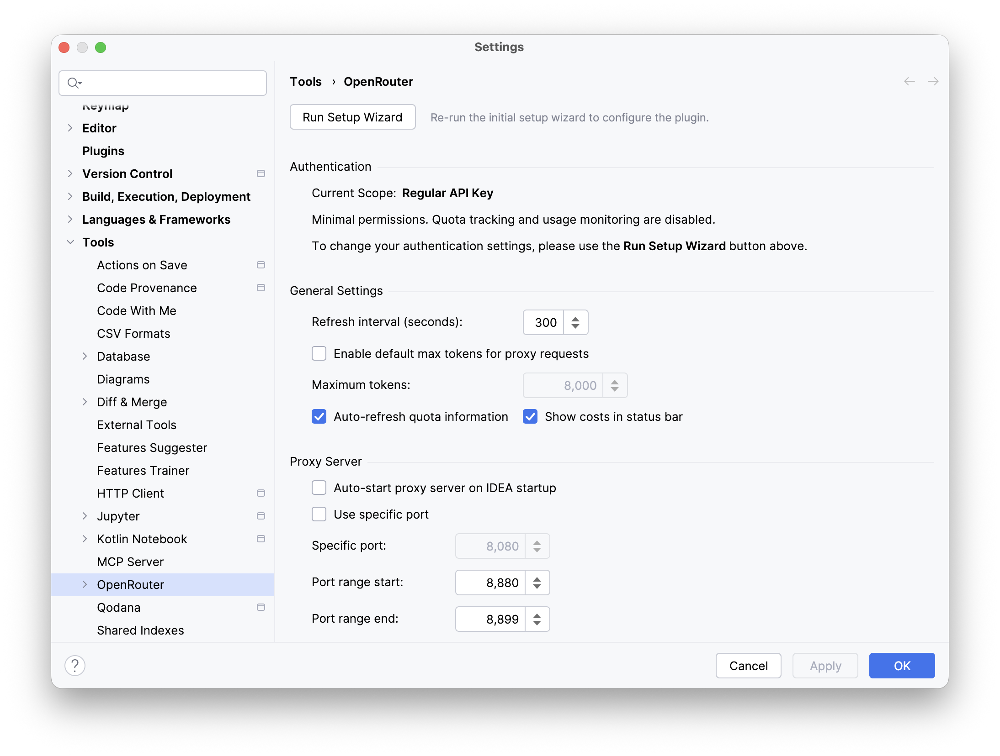
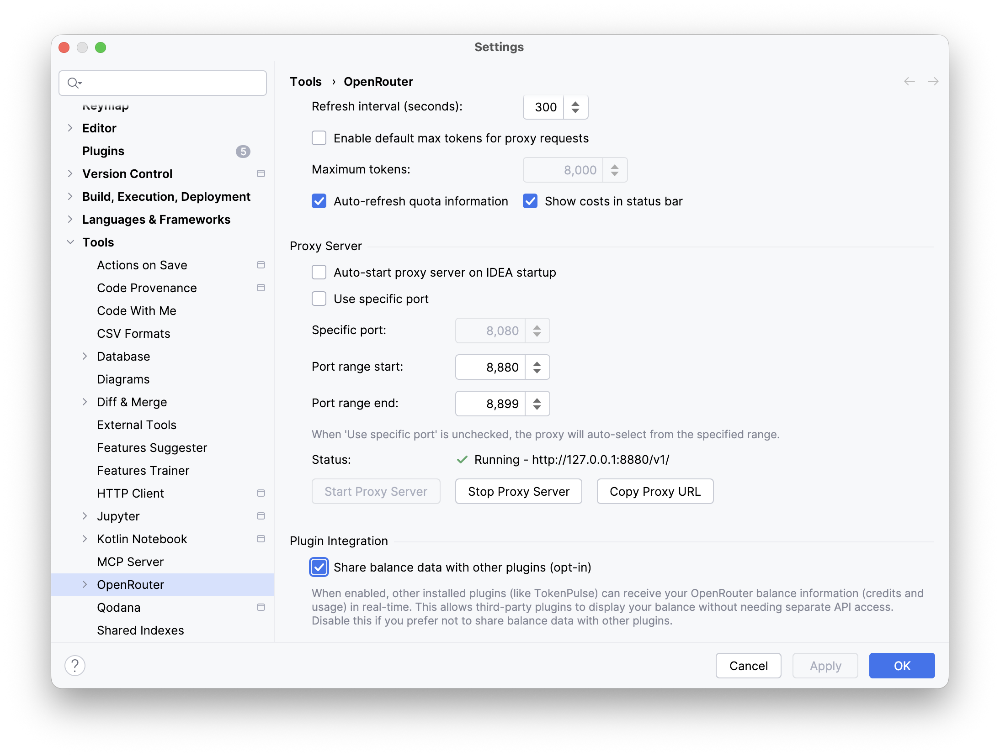
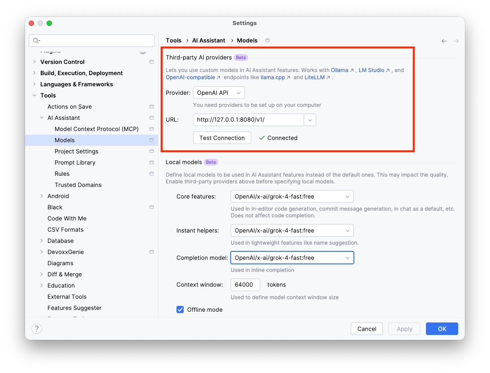
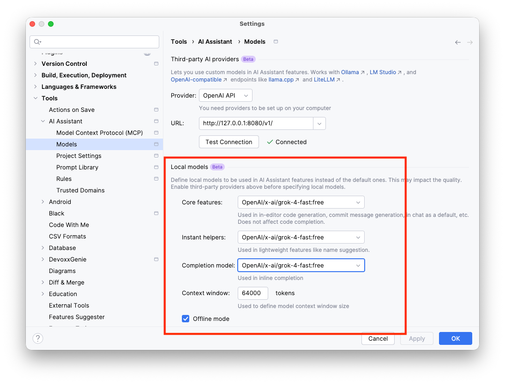
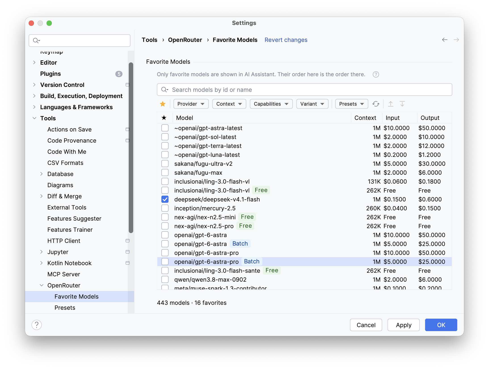

# AI Assistant Setup Guide

This guide explains how to configure JetBrains AI Assistant to use OpenRouter's 400+ AI models through the OpenRouter IntelliJ Plugin's local proxy server.

## 📋 Prerequisites

Before you begin, ensure you have:

1. **IntelliJ IDEA** (or any JetBrains IDE) version 2024.2 or later
2. **OpenRouter Plugin** installed and configured
3. **JetBrains AI Assistant Plugin** installed ([Get it here](https://plugins.jetbrains.com/plugin/22282-jetbrains-ai-assistant))
4. **OpenRouter Account** with a Provisioning Key ([Sign up here](https://openrouter.ai))

## 🚀 Quick Start

### Step 1: Configure OpenRouter Plugin

1. Open **Settings** → **Tools** → **OpenRouter**
2. Enter your **Provisioning Key** from [OpenRouter Provisioning Keys](https://openrouter.ai/settings/provisioning-keys)
3. Click **Apply** and **OK**

OpenRouter settings panel with provisioning key field

### Step 2: Start the Proxy Server

The proxy server should start automatically when you configure your Provisioning Key. You can verify it's running:

1. Open **Settings** → **Tools** → **OpenRouter**
2. Look for the **Proxy Server** section
3. Status should show: **Running on http://127.0.0.1:8880** (or another port 8880-8899)
4. **Copy** the proxy server URL - you'll need it in the next step

Proxy server section showing running status and URL

> **Note**: If the server isn't running, click **Start Server** button.

### Step 3: Configure AI Assistant (chat & core features)

Now point AI Assistant's **chat and core features** at the OpenRouter proxy. This is the primary setup — it drives the model selector in the chat window.

1. Open **Settings** → **Tools** → **AI Assistant** → **Providers & API keys**
2. In the **Third-party AI providers** section, select **OpenAI-compatible** and configure it:
   - **Server URL** / **URL**: Paste the proxy URL from Step 2 (e.g., `http://127.0.0.1:8880`)
   - **API Key**: Leave this **empty** — authentication is handled by the OpenRouter plugin. (If your IDE version forces a non-empty value, type any placeholder; it is ignored.)
   - **Tool calling**: **Enable this** if you want AI Assistant Agents to invoke MCP tools through tool-calling capable OpenRouter models

> **IDE version note:** JetBrains has reorganized this screen across releases. The steps above use the current wording. On **AI Assistant 2025.3+** the page is titled **Providers & API keys** and the option reads **OpenAI-compatible**. On **older IDEs (≤ 2025.2)** the page was titled **Models** and the option read **Other OpenAI-compatible service** — the settings live in the same place. The plugin also prints the exact, version-correct steps for your IDE — see **Tools** → **OpenRouter** and the setup wizard's "View AI Assistant Setup Guide".

AI Assistant custom model configuration dialog

3. Click **Test Connection** to verify the setup
4. Click **Apply** / **OK** to save

### Step 3.1: Connect MCP tools for agent workflows

If you want **agentic coding** instead of plain chat:

1. Open **Settings** → **Tools** → **AI Assistant** → **Model Context Protocol (MCP)**
2. Add one or more MCP servers that provide the tools you want the agent to use
3. Apply the configuration and verify the server shows a connected status

AI Assistant can then combine:

- this plugin's **OpenRouter-backed OpenAI-compatible proxy** for model inference,
- **MCP servers** for tool execution.

> **Important:** for agent workflows, you need both a **tool-capable model** and **Tool calling enabled** in AI Assistant's provider settings.

### Step 3.2: Configure inline code completion (optional, AI Assistant 2026.2+)

AI Assistant **2026.2** added a separate **AI Completion** section for **inline code completion and next-edit suggestions**. This is a *different* surface from the chat provider in Step 3 — configuring one does not configure the other. Set this up only if you want OpenRouter to power inline completion; it is optional.

1. Open **Settings** → **Tools** → **AI Assistant** → **Providers & API keys**
2. In the **AI Completion** section, select **OpenAI Compatible** and configure it:
   - **Base URL** / **URL**: Paste the proxy URL from Step 2 (e.g., `http://127.0.0.1:8880`)
   - **API Key**: Leave this **empty** — authentication is handled by the OpenRouter plugin. (If your IDE version forces a non-empty value, type any placeholder; it is ignored.)
   - **Model**: Pick an OpenRouter model you have starred as a favorite (see Step 4)
3. Click **Apply** / **OK** to save

> **Note:** This section only exists on **AI Assistant 2026.2 and later**. If you don't see **AI Completion**, your IDE is on an earlier release and only the chat setup in Step 3 applies. Inline-completion quality and latency depend heavily on the model you choose — prefer fast, completion-oriented models here.

### Step 4: Select OpenRouter Model

> **⚠️ Read this first — the #1 reason OpenRouter models "don't show up".**
> AI Assistant lists the models you have marked as **Favorites** in the
> OpenRouter plugin. If you don't star any, the proxy falls back to a small
> set of defaults, but AI Assistant may still not surface them — so the
> reliable path is to pick your favorites first. This is by design: it keeps
> the dropdown from being flooded with 400+ entries.

1. Pick your models first: open **Settings** → **Tools** → **OpenRouter** → **Favorite Models**, tick the **★** for the models you want, then **Apply** / **OK**. (See [Using Favorite Models](#using-favorite-models) below for the full workflow.)
2. In the AI Assistant chat window, click the **model selector** dropdown
3. Select one of your OpenRouter models — your favorites appear here, in the order you set
4. Start chatting with any of OpenRouter's 400+ models!

AI Assistant model selectors showing OpenRouter models

## 🎯 Available Models

The proxy server provides access to OpenRouter's entire model catalog. Here are some popular models you can use:

### OpenAI Models
- `openai/gpt-4o` - Most advanced GPT-4 model
- `openai/gpt-4o-mini` - Fast and cost-effective
- `openai/gpt-4-turbo` - High performance GPT-4
- `openai/gpt-3.5-turbo` - Fast and affordable

### Anthropic Models
- `anthropic/claude-3.5-sonnet` - Advanced reasoning and analysis
- `anthropic/claude-3-opus` - Most capable Claude model
- `anthropic/claude-3-haiku` - Fast and efficient

### Google Models
- `google/gemini-pro-1.5` - Advanced multimodal AI
- `google/gemini-flash-1.5` - Fast responses

### Meta Models
- `meta-llama/llama-3.1-70b-instruct` - Powerful open-source model
- `meta-llama/llama-3.1-8b-instruct` - Efficient instruction model

### Other Popular Models
- `mistralai/mistral-large` - Mistral's flagship model
- `qwen/qwen-2.5-72b-instruct` - Multilingual coding model
- `microsoft/wizardlm-2-8x22b` - Instruction following

> **Tip**: See the full list of available models at [OpenRouter Models](https://openrouter.ai/models) or in the plugin's Favorite Models panel.

## 🔧 Advanced Configuration

### Agent-ready model recommendations

For the best results in AI Assistant Agent mode, prefer models that support:

- **tools / functions**,
- **reasoning**,
- **long context windows**.

Use the Favorite Models panel to prioritize tool-capable coding models.

### Using Favorite Models

Favorite models are used to avoid loading all the hundreds of models available in OpenRouter and overloading the 
selectors in the AI Assistant. All models in the Assistant's selectors are shown from the Favorites list.

You can configure your favorite models for quick access:

1. Open **Settings** → **Tools** → **OpenRouter** → **Favorite Models**
2. Tick the **★** checkbox next to each model you want; use the search field and the Provider / Context /
   Capabilities / Variant drop-downs to narrow the catalog, or pick a bundle from **Presets**
3. Switch on **Favorites only** (the star in the toolbar) to see your list in the order AI Assistant will show it
4. Reorder with **↑** / **↓**, Alt+↑/↓, or drag rows
5. Click **Apply** and **OK**

Favorite Models settings panel

### Changing Proxy Port

If port 8880 is already in use, the plugin will automatically try ports 8881-8899. You can check which port is being used:

1. Open **Settings** → **Tools** → **OpenRouter**
2. Look at the **Proxy Server** section
3. The current port is shown in the server URL

### Proxy Server Management

You can manually control the proxy server:

- **Start Server**: Click **Start Server** button in settings
- **Stop Server**: Click **Stop Server** button in settings
- **Auto-start**: The server starts automatically when you configure a Provisioning Key
- **Status**: Check the status indicator in the OpenRouter status bar widget

## 🐛 Troubleshooting

### Proxy Server Won't Start

**Problem**: Server status shows "Stopped" or error message

**Solutions**:
1. Verify your Provisioning Key is valid in OpenRouter settings
2. Check if ports 8880-8899 are available (close other applications using these ports)
3. Check IDE logs: **Help** → **Show Log in Finder/Explorer**
4. Look for errors containing "OpenRouter" or "proxy"

### AI Assistant Can't Connect

**Problem**: "Connection failed" error when testing in AI Assistant

**Solutions**:
1. Verify the proxy server is running (check OpenRouter settings)
2. Copy the exact server URL from OpenRouter settings (including `http://` and port)
3. Make sure you're using `http://127.0.0.1:PORT` not `localhost:PORT`
4. Try restarting the proxy server (Stop → Start)

### Only JetBrains Models Appear — No OpenRouter Models

**Problem**: The connection tests fine, but the AI Assistant model selector only
shows JetBrains' own models. You can't pick any OpenRouter model.

**Solutions**:
1. **Add favorites first** — AI Assistant lists the models you have starred in
   **Settings** → **Tools** → **OpenRouter** → **Favorite Models**. With an empty
   favorites list the proxy returns only a small default set, which AI Assistant
   may not surface reliably. Star at least one model, click **Apply** / **OK**,
   then reopen the selector.
2. **Refresh the list** — after changing favorites, restart the proxy server
   (Stop → Start) so AI Assistant re-fetches the model list.
3. **Confirm the provider is the custom one** — make sure the chat is using your
   **OpenAI-compatible** provider (called **Other OpenAI-compatible service** on
   IDEs ≤ 2025.2), not the default JetBrains provider.

### Model Not Found Error

**Problem**: AI Assistant shows "Model not found" error

**Solutions**:
1. Verify the model ID is correct (check [OpenRouter Models](https://openrouter.ai/models))
2. Use the full model ID including provider prefix (e.g., `openai/gpt-4o` not just `gpt-4o`)
3. Check that your OpenRouter account has access to the model

### Authentication Errors

**Problem**: 401 Unauthorized or authentication errors

**Solutions**:
1. Verify your Provisioning Key is valid at [OpenRouter Settings](https://openrouter.ai/settings/provisioning-keys)
2. Check that the key has sufficient credits
3. Re-enter the Provisioning Key in OpenRouter plugin settings
4. Click **Test Connection** to verify

## 📚 Additional Resources

- **OpenRouter Documentation**: [https://openrouter.ai/docs](https://openrouter.ai/docs)
- **Plugin GitHub**: [https://github.com/DimazzzZ/openrouter-intellij-plugin](https://github.com/DimazzzZ/openrouter-intellij-plugin)
- **Report Issues**: [GitHub Issues](https://github.com/DimazzzZ/openrouter-intellij-plugin/issues)
- **AI Assistant Plugin**: [JetBrains Marketplace](https://plugins.jetbrains.com/plugin/22282-jetbrains-ai-assistant)

## 💡 Tips & Best Practices

1. **Start with GPT-4o Mini**: It's fast, affordable, and works great for most coding tasks
2. **Use Favorite Models**: Configure your most-used models for quick access
3. **Monitor Usage**: Check the OpenRouter status bar widget for real-time usage statistics
4. **Try Different Models**: Different models excel at different tasks - experiment to find what works best
5. **Check Costs**: View detailed cost breakdown in **Tools** → **OpenRouter** → **Show Usage Statistics**

## 🔐 Security & Privacy

- **Local Proxy**: The proxy server runs only on `127.0.0.1` (localhost) - no external access
- **Encrypted Storage**: Your Provisioning Key is encrypted using IntelliJ's secure credential storage
- **No Data Collection**: The plugin doesn't collect or transmit any usage data
- **Direct Connection**: All API calls go directly from your machine to OpenRouter's servers

## ❓ FAQ

**Q: Can I use AI Assistant Agents with OpenRouter only?**  
A: Yes, that is the intended setup for this plugin. Configure AI Assistant to use the plugin proxy as an OpenAI-compatible provider, enable **Tool calling**, and connect MCP servers for tools.

**Q: Does this require a JetBrains AI subscription?**  
A: Not for the OpenRouter-backed provider path itself. However, some JetBrains proprietary AI features are not fully available in strict BYOK/custom-provider mode.

**Q: What features may still be limited in strict BYOK mode?**  
A: JetBrains documents that certain proprietary features, including **Next edit suggestions** and some **code completion** paths, may remain unavailable when using only custom providers.

**Q: Do I need a paid OpenRouter account?**  
A: No, OpenRouter offers free credits to get started. You can use the plugin with a free account.

**Q: Can I use multiple models simultaneously?**  
A: Yes! You can configure multiple custom models in AI Assistant, each pointing to the same proxy but using different model IDs.

**Q: Does this work with other JetBrains IDEs?**  
A: Yes! The plugin works with all JetBrains IDEs (WebStorm, PyCharm, PhpStorm, etc.) version 2024.2+.

**Q: Will this affect my existing AI Assistant configuration?**  
A: No, this adds a custom model alongside your existing AI Assistant models. You can switch between them freely.

**Q: How do I update the model list?**  
A: The proxy automatically fetches the latest model list from OpenRouter. Just restart the proxy server to refresh.

---

**Need help?** Open an issue on [GitHub](https://github.com/DimazzzZ/openrouter-intellij-plugin/issues) or check the [troubleshooting guide](../DEBUGGING.md).
